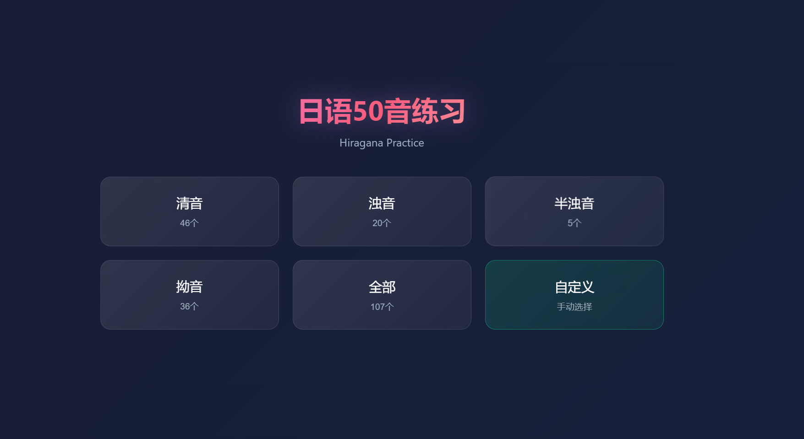
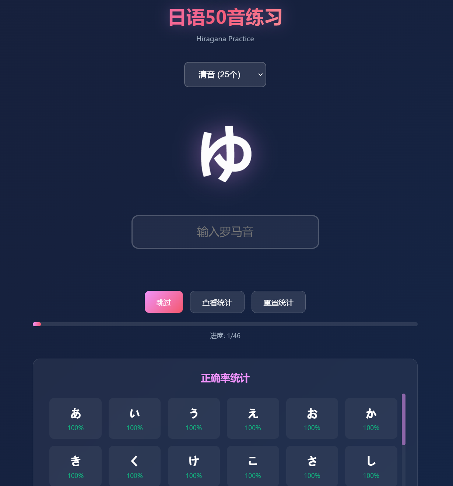
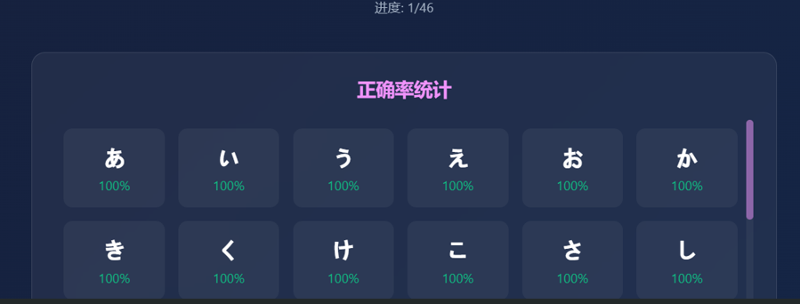
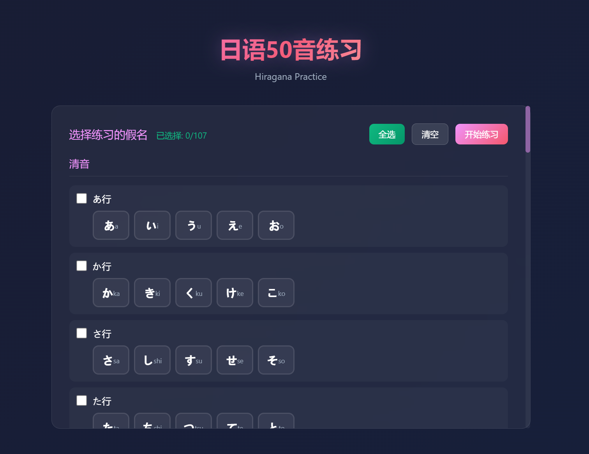
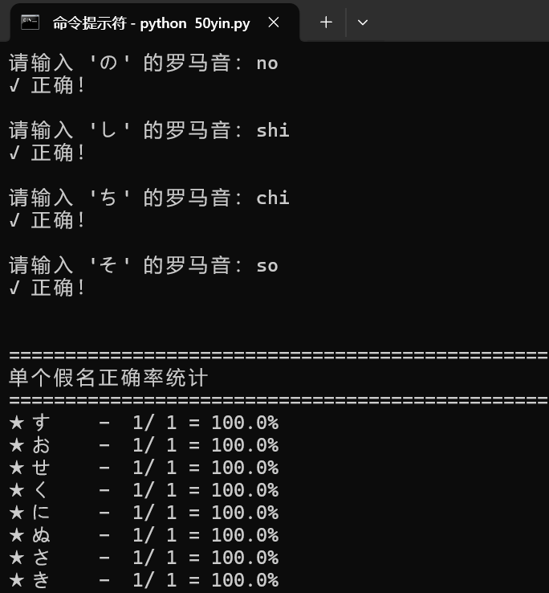

# 日语50音练习 - 使用说明

一个美观、高效的日语平假名练习网页应用，支持键盘打击感、自定义练习范围等功能。

## 功能特点

- 🎯 **完整50音覆盖** - 包含清音、浊音、半浊音、拗音共107个假名
- ⌨️ **键盘打击感** - 每次按键都有视觉反馈，练习更有节奏感
- 🎨 **动态背景** - 缓慢变化的渐变背景，减少视觉疲劳
- ✨ **粒子特效** - 答对/答错时有爆炸粒子效果
- 📊 **实时统计** - 记录每个假名的正确率，按正确率排序显示
- 🎛️ **自定义范围** - 可按行选择练习内容，灵活度高
- 💾 **本地存储** - 练习记录自动保存到浏览器

## 快速开始

1. 在浏览器中打开 `index.html` 文件
2. 点击选择练习范围（清音/浊音/半浊音/拗音/全部/自定义）
3. 看到假名后，输入对应的罗马音
4. 按回车或空格键提交答案
5. 正确/错误后会自动进入下一题

---

## 使用教程

### 1. 主菜单界面

打开网页后，会看到主菜单，包含6个选项按钮：

- **清音** - 练习基础46个假名
- **浊音** - 练习20个浊音假名
- **半浊音** - 练习5个半浊音假名
- **拗音** - 练习36个拗音假名
- **全部** - 练习所有107个假名
- **自定义** - 手动选择要练习的假名

> 

---

### 2. 开始练习

点击任意范围按钮后，进入练习界面：

1. **题目显示** - 屏幕中央显示大号假名
2. **输入答案** - 在输入框中输入对应的罗马音
3. **提交方式**：
   - 按回车键（Enter）
   - 按空格键
4. **自动跳转**：
   - 答对：300毫秒后自动下一题
   - 答错：1.5秒后自动下一题（显示正确答案）


---

### 3. 练习界面功能

#### 顶部导航
- **← 返回菜单** - 点击返回主菜单

#### 练习范围切换
- 下拉选择框可随时切换练习范围

#### 控制按钮
- **跳过** - 跳过当前题目，进入下一题
- **查看统计** - 展开/收起统计面板
- **重置统计** - 清空当前范围的练习记录

#### 进度显示
- 进度条显示当前练习进度
- 文字提示显示已完成数量

> 

---

### 4. 答案反馈

#### 答对时
- 输入框显示绿色边框
- 显示 "✓ 正确！"
- 绿色粒子爆炸特效
- 300毫秒后自动进入下一题


#### 答错时
- 输入框显示红色边框并抖动
- 显示 "✗ 错误！正确答案：xxx"
- 红色粒子爆炸特效
- 1.5秒后自动进入下一题


---

### 5. 统计面板

点击"查看统计"按钮，展开统计面板：

- **排序显示** - 按正确率从高到低排序
- **颜色标记**：
  - 🟢 绿色（90%+）：掌握熟练
  - 🟡 黄色（70%+）：还需巩固
  - 🔴 红色（<70%）：需要重点练习
- **悬停提示** - 鼠标悬停显示详细数据（正确数/总数=正确率）

> 

---

### 6. 自定义练习

点击主菜单的"自定义"按钮，进入假名选择界面：

#### 按行分组
假名按行排列，包括：
- 清音：あ行、か行、さ行、た行、な行、は行、ま行、や行、ら行、わ行
- 浊音：が行、ざ行、だ行、ば行
- 半浊音：ぱ行
- 拗音：各行拗音

#### 选择方式

1. **按行选择** - 点击行首的复选框，一键选中整行
2. **单个选择** - 点击单个假名，单独勾选/取消

#### 快捷操作
- **全选** - 选中所有假名
- **清空** - 取消所有选择
- **开始练习** - 进入练习模式（需至少选择1个）

> 

---

#### python命令行

1. 摸鱼的时候用的，通过命令行练习
```
python 50yin.py
```

> 

---

### 7. 键盘快捷操作

| 快捷键 | 功能 |
|--------|------|
| Enter | 提交答案 |
| Space | 提交答案 |
| 任意字母键 | 显示按键反馈动画 |

---

### 8. 数据存储

- 练习记录自动保存到浏览器本地存储
- 关闭浏览器后数据不会丢失
- 可随时查看或重置统计数据

---

## 假名对照参考

### 清音（46个）
| あ | い | う | え | お | a | i | u | e | o |
|---|---|---|---|---|---|---|---|---|---|
| か | き | く | け | こ | ka | ki | ku | ke | ko |
| さ | し | す | せ | そ | sa | shi| su | se | so |
| た | ち | つ | て | と | ta | chi| tsu| te | to |
| な | に | ぬ | ね | の | na | ni | nu | ne | no |
| は | ひ | ふ | へ | ほ | ha | hi | fu | he | ho |
| ま | み | む | め | も | ma | mi | mu | me | mo |
| や | - | ゆ | - | よ | ya | - | yu | - | yo |
| ら | り | る | れ | ろ | ra | ri | ru | re | ro |
| わ | を | - | - | ん | wa | o | - | - | n |

### 浊音（20个）
| が | ぎ | ぐ | げ | ご | ga | gi | gu | ge | go |
|---|---|---|---|---|---|---|---|---|---|
| ざ | じ | ず | ぜ | ぞ | za | ji | zu | ze | zo |
| だ | ぢ | づ | で | ど | da | ji | zu | de | do |
| ば | び | ぶ | べ | ぼ | ba | bi | bu | be | bo |

### 半浊音（5个）
| ぱ | ぴ | ぷ | ぺ | ぽ | pa | pi | pu | pe | po |

### 拗音（36个）
| きゃ | きゅ | きょ | kya | kyu | kyo |
|---|---|---|---|---|---|
| ぎゃ | ぎゅ | ぎょ | gya | gyu | gyo |
| しゃ | しゅ | しょ | sha | shu | sho |
| じゃ | じゅ | じょ | ja | ju | jo |
| ちゃ | ちゅ | ちょ | cha | chu | cho |
| ぢゃ | ぢゅ | ぢょ | ja | ju | jo |
| にゃ | にゅ | にょ | nya | nyu | nyo |
| ひゃ | ひゅ | ひょ | hya | hyu | hyo |
| びゃ | びゅ | びょ | bya | byu | byo |
| ぴゃ | ぴゅ | ぴょ | pya | pyu | pyo |
| みゃ | みゅ | みょ | mya | myu | myo |
| りゃ | りゅ | りょ | rya | ryu | ryo |

---

## 练习建议

1. **初学者**：先从清音开始，按行逐行练习
2. **进阶练习**：使用自定义功能，选择薄弱的假名重点练习
3. **巩固提升**：通过统计面板查看正确率，重点练习红色标记的假名
4. **综合练习**：熟练后使用"全部"模式进行随机练习

---

## 技术说明

- 纯前端实现，无需服务器
- 使用 HTML5 + CSS3 + JavaScript
- 数据存储使用 localStorage
- 响应式设计，支持不同屏幕尺寸

---

